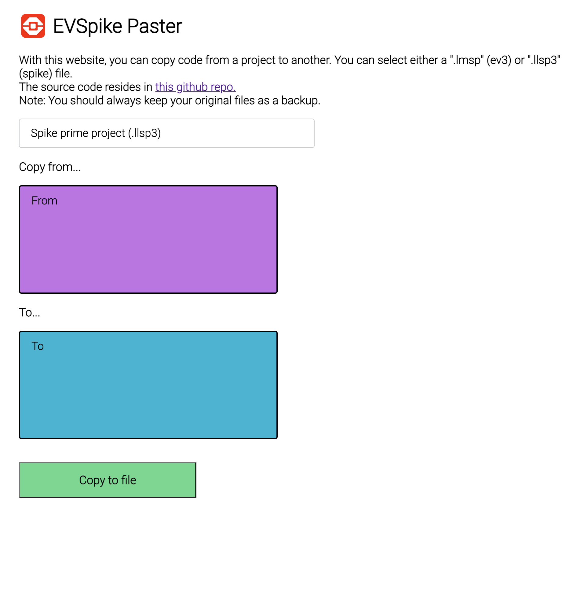

# EVSpike

**EVSpike** is a website made with vanilla javasript to copy-paste blocks from projects to projects (ev3 and spike). EVSpike can also run offline (so you can download the source to run it on your computer).

You can access it at https://evspike.origaming.ch.